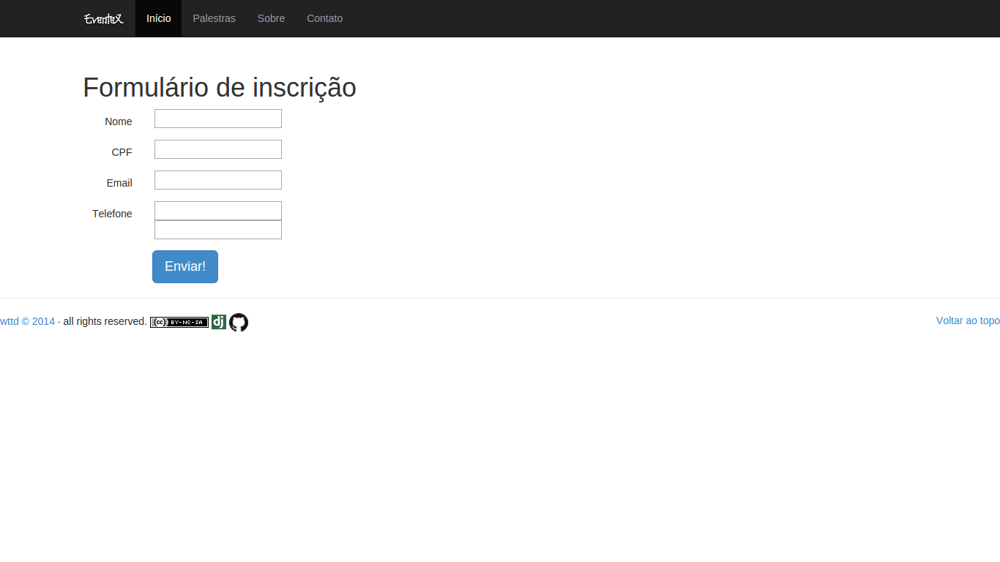

# EventeX

EventeX é um projeto elaborado a partir do curso [Welcome to the Django][1] do [Henrique Bastos][2]

O objetivo é criar um site de eventos usando todos os recursos aprendidos durante o curso.

O primeiro projeto a gente nunca esquece. 2014

Its is off line :(

# Screenshot

[1]: http://welcometothedjango.com.br/
[2]: http://henriquebastos.net/
